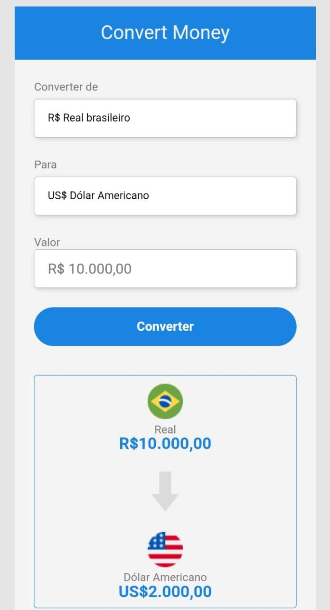

# Convert-Money

  

<h3> => Projeto de conversão de moedas 💲💲 <= </h3>
  

<h4> Este projeto converte o Real (BRL) em Dólar Americano(USD), Euro(EUR) ou em Bitcoin.   

Bem simples, porém agregou muito no aprendizado cotidiano!
</h4>

------ 💻 --------- 💻 -------- 💻 -------- 💻
 

<h2> Habilidades utilizadas:</h2>
<ul>
<li> ✅ HTMl;</li>
<li> ✅ CSS;</li>
<li> ✅ JavaScript. </li>
</ul>
  

------ 💻 --------- 💻 -------- 💻 -------- 💻
 

<h3> ☑️ Projeto concluído ☑️ </h3>